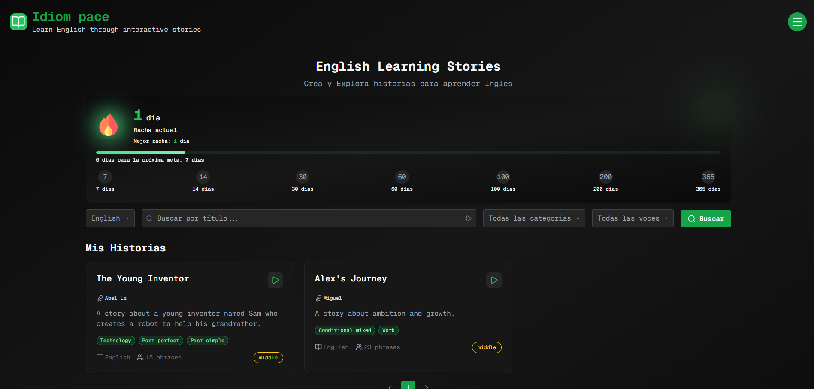
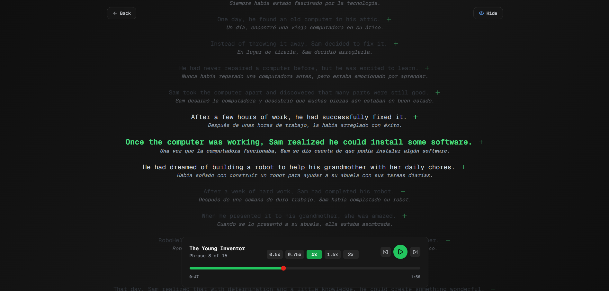
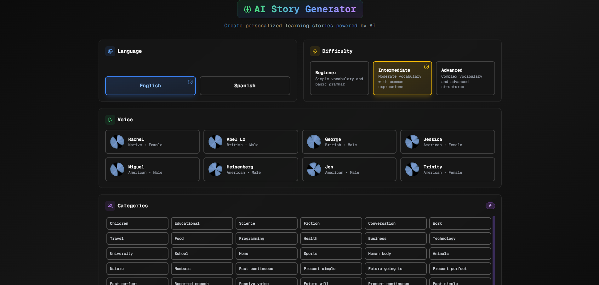
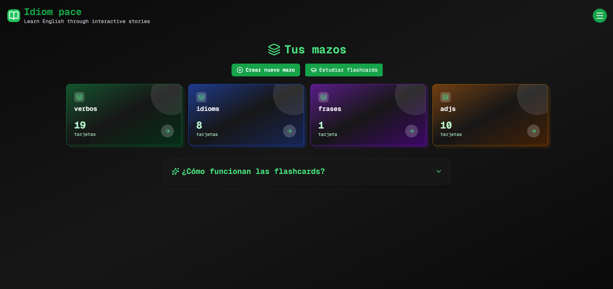
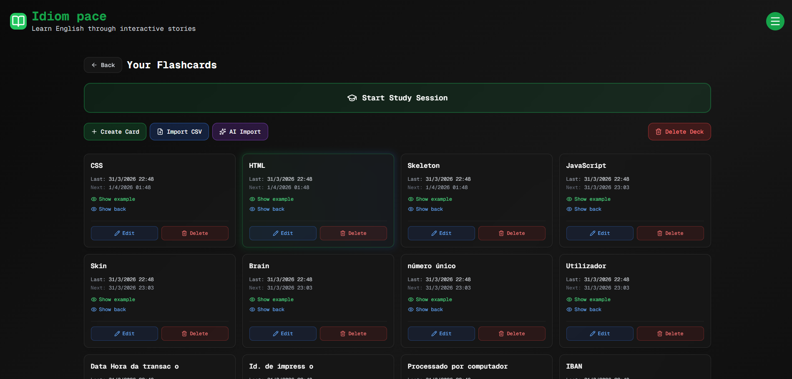
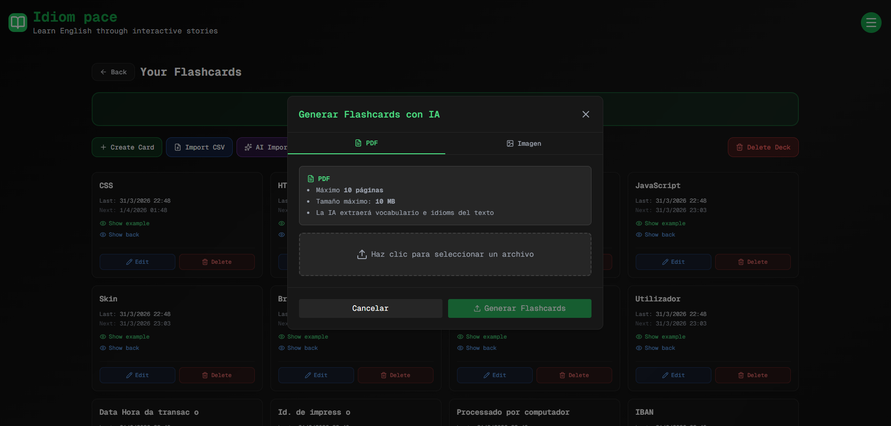
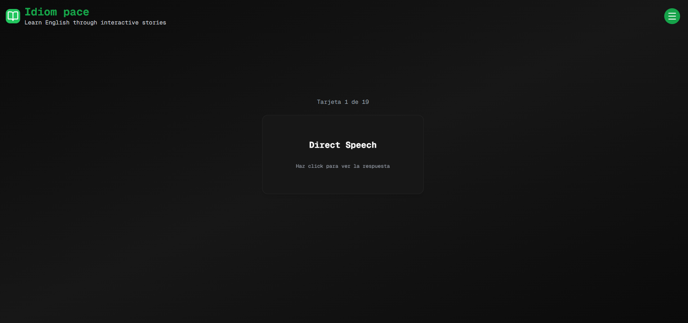
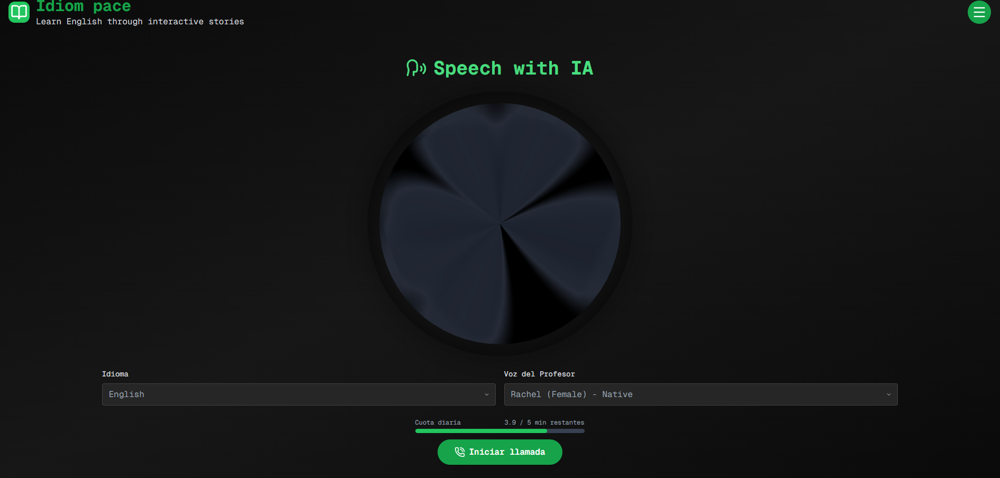
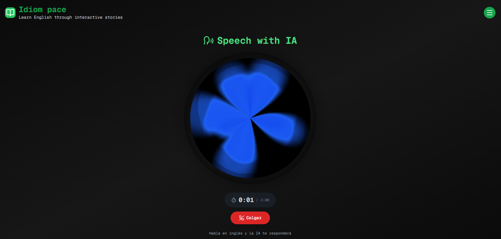
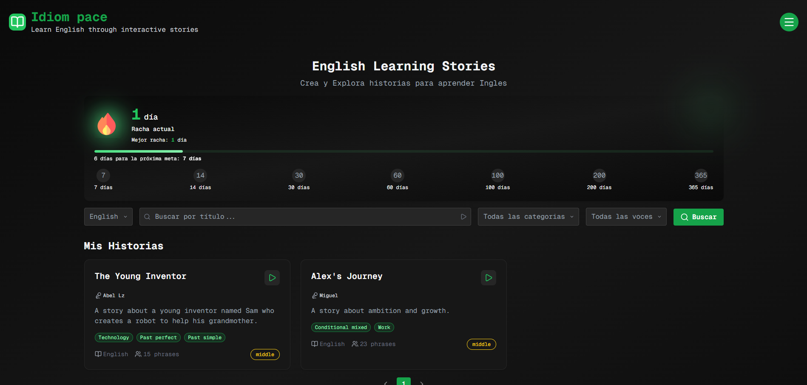

# Idiom Pace — Guía de usuario

Idiom Pace es una plataforma para aprender inglés (o español) mediante historias generadas por IA, conversaciones en tiempo real con voces sintéticas y un sistema de flashcards con repetición espaciada.

---

## Índice

1. [Pantalla principal — Historias](#1-pantalla-principal--historias)
2. [Reproductor de historia](#2-reproductor-de-historia)
3. [Generar historia con IA](#3-generar-historia-con-ia)
4. [Flashcards — Gestión de mazos](#4-flashcards--gestión-de-mazos)
5. [Mazo individual](#5-mazo-individual)
6. [Estudiar flashcards](#6-estudiar-flashcards)
7. [Speech with IA — Conversación en vivo](#7-speech-with-ia--conversación-en-vivo)
8. [Racha de aprendizaje](#8-racha-de-aprendizaje)

---

## 1. Pantalla principal — Historias

> **Ruta:** `/`

Esta es la página de inicio. Muestra todas las historias disponibles organizadas en dos secciones:

- **Mis historias** — historias generadas por ti.
- **Historias de la comunidad** — historias creadas por otros usuarios.

### Filtros y búsqueda

En la parte superior encontrarás controles para filtrar el catálogo:

| Control | Función |
|---------|---------|
| Barra de búsqueda | Filtra por título |
| Selector de idioma | Alterna entre historias en inglés y español |
| Selector de categoría | Filtra por tema (Negocios, Viajes, etc.) |
| Selector de voz | Filtra por el narrador de la historia |

La lista se pagina de 12 en 12 historias.

### Imagen sugerida

<!--
  IMAGEN 1 — Pantalla principal
  Coloca una captura de la página de inicio mostrando el grid de historias y los filtros.
  Nombre de archivo recomendado: docs/screenshots/01-home.png
  Instrucción: haz una captura con al menos 6 tarjetas de historia visibles.
-->

---

## 2. Reproductor de historia

> **Ruta:** `/stories/:id`

Al hacer clic en una historia se abre el reproductor. Aquí puedes escuchar la historia narrada frase por frase mientras el texto se resalta en sincronía con el audio.

### Secciones del reproductor

#### Reproductor de audio
El audio avanza automáticamente y resalta la frase que se está escuchando. Puedes pausar, retroceder o avanzar manualmente.

#### Traducción
Hay un botón para activar la traducción. Cuando está activa, cada frase muestra su equivalente en el otro idioma debajo del texto original.

#### Vocabulario
Al final de la historia aparece una lista de palabras clave con su significado, traducción y un ejemplo de uso en contexto.

#### Ejercicios
Preguntas de comprensión de opción múltiple basadas en el contenido de la historia. Al responder, el sistema indica si fue correcto y muestra la explicación.

#### Guardar frases como flashcard
Junto a cada frase hay un botón para guardarla directamente como flashcard en cualquiera de tus mazos.

### Imagen sugerida

<!--
  IMAGEN 2 — Reproductor de historia
  Coloca una captura del reproductor con una historia activa y la sección de vocabulario visible.
  Nombre de archivo recomendado: docs/screenshots/02-story-viewer.png
-->

---

## 3. Generar historia con IA

> **Ruta:** `/generate-story`

Permite crear una historia nueva a partir de los parámetros que elijas. La generación tarda aproximadamente 2–3 minutos ya que la IA escribe el texto, lo narra y sincroniza el audio.

### Parámetros de generación

| Campo | Opciones |
|-------|---------|
| Idioma | English / Spanish |
| Nivel | Beginner / Intermediate / Advanced |
| Voz | Lista de voces de ElevenLabs (género, acento) |
| Categorías | Selección múltiple (Negocios, Viajes, Familia, etc.) |

### Vista previa de voz
Antes de generar puedes escuchar una muestra de la voz seleccionada para asegurarte de que te guste el narrador.

> **Límite:** existe un límite de historias generadas por hora para proteger el uso de la IA.

### Imagen sugerida

<!--
  IMAGEN 3 — Formulario de generación
  Coloca una captura del formulario con algunos campos rellenos y el selector de categorías visible.
  Nombre de archivo recomendado: docs/screenshots/03-generate-story.png
-->

---

## 4. Flashcards — Gestión de mazos

> **Ruta:** `/flashcards`

Panel de control para organizar tus flashcards en mazos temáticos.

### Crear un mazo
Haz clic en **Nuevo mazo**, introduce un nombre y se creará con un color aleatorio. Puedes tener tantos mazos como quieras (por tema, nivel, historia, etc.).

### Acciones disponibles
- **Abrir mazo** — ver y editar las tarjetas del mazo.
- **Estudiar todos** — iniciar una sesión de estudio con todas las tarjetas pendientes de todos tus mazos a la vez.

### Imagen sugerida

<!--
  IMAGEN 4 — Pantalla de mazos
  Coloca una captura que muestre varios mazos con diferentes colores y sus contadores de tarjetas.
  Nombre de archivo recomendado: docs/screenshots/04-manage-decks.png
-->

---

## 5. Mazo individual

> **Ruta:** `/flashcards/deck/:deckId`

Vista detallada de un mazo específico. Muestra todas las tarjetas del mazo y permite gestionarlas.

### Crear tarjetas

#### Manualmente
Rellena el campo **Frente** (pregunta/palabra) y **Reverso** (respuesta/traducción) y guarda.

#### Con IA — PDF o imagen
Abre el botón **Importar con IA** para subir un PDF o una imagen. La IA extrae el contenido y genera sugerencias de flashcards automáticamente. Puedes revisar cada sugerencia, eliminar las que no quieras y guardar el resto en el mazo con un clic.

Formatos aceptados:
- PDF (máx. 10 MB)
- Imagen JPG / PNG / WEBP / GIF (máx. 10 MB)

> **Límite:** 5 PDFs y 5 imágenes por día.

### Editar y eliminar tarjetas
Cada tarjeta tiene botones de editar (lápiz) y eliminar (papelera) para mantener el mazo actualizado.

### Imagen sugerida

<!--
  IMAGEN 5 — Mazo individual
  Coloca una captura del interior de un mazo con varias flashcards visibles.
  Nombre de archivo recomendado: docs/screenshots/05-deck-detail.png
-->

<!--
  IMAGEN 6 — Modal de importación con IA
  Coloca una captura del modal de importación con las pestañas PDF/Imagen y algunas flashcards sugeridas.
  Nombre de archivo recomendado: docs/screenshots/06-upload-ai-modal.png
-->

---

## 6. Estudiar flashcards

> **Ruta:** `/flashcards/try/:deckId`

Sesión de estudio con repetición espaciada (algoritmo SM-2). Solo aparecen las tarjetas que toca repasar hoy según tu historial.

### Cómo funciona una sesión

1. Aparece el **frente** de la tarjeta (palabra o pregunta).
2. Piensas la respuesta y haces clic en **Girar** para ver el reverso.
3. Marcas si lo sabías (**Correcto**) o no (**Incorrecto**).
4. El algoritmo ajusta cuándo volverá a aparecer esa tarjeta: las fáciles aparecen menos frecuentemente, las difíciles vuelven pronto.
5. Al terminar todas las tarjetas pendientes, la sesión concluye y se suman puntos a tu racha diaria.

> Si no hay tarjetas pendientes para hoy, el sistema te lo indica y puedes volver mañana.

### Imagen sugerida

<!--
  IMAGEN 7 — Sesión de estudio
  Coloca una captura de una tarjeta abierta (frente visible) con los botones de Correcto/Incorrecto.
  Nombre de archivo recomendado: docs/screenshots/07-study-flashcards.png
-->

---

## 7. Speech with IA — Conversación en vivo

> **Ruta:** `/speech-with-ia`

Practica conversación hablada con un profesor de IA en tiempo real. Tú hablas con el micrófono, la IA entiende lo que dices y responde con voz sintética.

### Configuración previa

Antes de iniciar la llamada puedes elegir:

- **Idioma** — el idioma en que quieres practicar (English / Spanish).
- **Voz del profesor** — cada voz tiene una personalidad distinta (formal, casual, con humor, etc.).

### Cuota diaria

Debajo de la configuración se muestra una barra con los minutos disponibles. Cada usuario tiene **5 minutos de llamada por día**. La barra se actualiza al terminar cada llamada.

- Verde → quedan más de 2 minutos
- Amarillo → queda entre 1 y 2 minutos
- Rojo → menos de 1 minuto

El botón **Iniciar llamada** se desactiva automáticamente cuando la cuota está agotada.

### Durante la llamada

El orbe central cambia de color según el estado:

| Color | Estado |
|-------|--------|
| Gris | Inactivo (sin llamada) |
| Amarillo | Conectando / Procesando |
| Azul | Escuchando tu voz |
| Verde | El profesor está hablando |

El temporizador muestra el tiempo transcurrido y el límite de la sesión. A los 10 segundos del final aparece una advertencia y el profesor se despide automáticamente.

### Flashcards sugeridas
Al terminar la llamada (si duró más de 30 segundos) el sistema analiza la conversación y sugiere flashcards con el vocabulario trabajado. Puedes guardarlas en cualquiera de tus mazos.

### Imagen sugerida

<!--
  IMAGEN 8 — Pantalla Speech with IA (estado IDLE con barra de cuota)
  Coloca una captura antes de iniciar la llamada, con la barra de cuota y los selectores visibles.
  Nombre de archivo recomendado: docs/screenshots/08-speech-idle.png
-->

<!--
  IMAGEN 9 — Speech with IA durante una llamada activa
  Coloca una captura con el orbe en color azul (LISTENING) y el temporizador en marcha.
  Nombre de archivo recomendado: docs/screenshots/09-speech-active.png
-->

---

## 8. Racha de aprendizaje

El contador de racha (llama de fuego) aparece en la pantalla principal y se incrementa una vez al día cuando completas cualquiera de estas actividades:

- Completar una sesión de estudio de flashcards.
- Leer/escuchar una historia hasta el final.

El contador muestra:
- **Racha actual** — días consecutivos con actividad.
- **Racha máxima** — el récord personal.

Mantener la racha activa refuerza el hábito de práctica diaria.

### Imagen sugerida

<!--
  IMAGEN 10 — Contador de racha
  Coloca una captura del contador de racha visible en la pantalla principal, preferiblemente con un número > 1.
  Nombre de archivo recomendado: docs/screenshots/10-streak.png
-->

---

## Resumen de imágenes necesarias

Crea la carpeta `docs/screenshots/` en la raíz del proyecto y coloca los siguientes archivos:

| Archivo | Sección | Descripción |
|---------|---------|-------------|
| `01-home.png` | Pantalla principal | Grid de historias con filtros visibles |
| `02-story-viewer.png` | Reproductor | Historia activa con vocabulario |
| `03-generate-story.png` | Generar historia | Formulario con categorías seleccionadas |
| `04-manage-decks.png` | Gestión de mazos | Varios mazos con colores distintos |
| `05-deck-detail.png` | Mazo individual | Interior del mazo con tarjetas |
| `06-upload-ai-modal.png` | Importar con IA | Modal con flashcards sugeridas |
| `07-study-flashcards.png` | Estudiar | Tarjeta abierta con botones de respuesta |
| `08-speech-idle.png` | Speech — inicio | Barra de cuota y selectores |
| `09-speech-active.png` | Speech — activa | Orbe azul con temporizador |
| `10-streak.png` | Racha | Contador con racha > 1 día |
